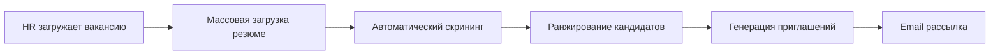

# Хакатон AI-Melbwbyf /трек AI-(команда Lilu)
# 🤖 Lilu - AI-medical assistant
<div align="center">

[](https://streamlit.io/)

[](https://python.org/)

**Revolutionizing recruitment with AI-driven voice interviews and intelligent candidate matching**

</div>

## Lilu - AI-помощник, который понимает вашу проблему и задает правильные вопросы:

### 🚀 Инновационные особенности:
- **Голосовое AI-взаимодействие** с реалистичным голосом
- **Умный анализ жалоб пациента** на основе  Qwen3-235B-A22B-Instruct-2507-FP8 
- **Автоматическая генерация персонализированных вопросов** с учетом специфики зпболевания


### 💡 Почему это наилучшее решение:

| Особенность | Преимущество | Технология |
|-------------|--------------|------------|
| 
| **Голосовой интерфейс** | Естественное взаимодействие | Yandex SpeechKit |
| **Контекстная генерация вопросов** | Релевантность  | Qwen3-235B |
| **Автоматическая оценка** | Оценка соответсвия потребости пацинета и квалификации врача | ML-алгоритмы |

## 📊 Как это работает


### 🔧 Технологический стек


**Frontend & Interaction:**
- **Streamlit 1.32.0** - веб-интерфейс и управление состоянием
- **Yandex SpeechKit** - синтез речи интервьюера и распознавание текста
- **SoundDevice 0.4.6** + **SoundFile 0.12.1** - запись аудиоответов


**Вспомогательные библиотеки:**
- **requests 2.31.0** - HTTP запросы к API
- **pygame 2.5.0** + **playsound 1.3.0** - воспроизведение аудио


### 📋 Описание ключевых файлов:

| Файл | Назначение |
|------|------------|
| **`app_streamlit_loc.py`** | Основное веб-приложение (запуск отсюда) |
| **`app.py`** | Класс InterviewBot - ядро системы |
| **`document_processor.py`** | Чтение PDF, DOCX, RTF, TXT, CSV, JSON |
| **`audio_recording.py`** | Запись аудиоответов кандидатов |
| **`audio_text.py`** | Синтез и распознавание речи |
| **`config.py`** | Настройки API ключей (создать) |

### 🗂️ Автоматически создаваемые папки:

| Папка | Содержимое |
|-------|------------|
| **`audio/questions/`** | Озвученные вопросы (генерируются) |
| **`audio/answers/`** | Ответы кандидатов (записываются) |
| **`reports/`** | Отчеты в JSON и TXT форматах |
| **`model/`** | Локальная модель RuBERT-Tiny2 |

---
## ⚙️ Установка и запуск

### 1. Клонирование и настройка

```bash
# Клонируйте репозиторий
git clone https://github.com/OlgaKonshina/Lilu
cd Lilu

# Создайте виртуальное окружение
python -m venv venv
source venv/bin/activate  # Linux/Mac
# или
venv\Scripts\activate     # Windows

# Установите зависимости
pip install -r requirements.txt
```
##  2. Настройка API ключей
```
Создайте файл config.py в корне проекта:
DEEPSEEK_API_KEY = "your-deepseek-api-key-here"
YANDEX_API_KEY = "your-yandex-cloud-api-key-here" 
YANDEX_FOLDER_ID = "your-yandex-folder-id-here"
```

### 4. Запуск приложения
```
streamlit run app3.py
Приложение будет доступно по адресу: http://localhost:8501
```
## 🎯 Как использовать платформу

### 📋 Пошаговое руководство

**Шаг 1: 📂 Загрузка документов**
- Загрузите описание вакансии (PDF, DOCX, RTF, TXT, CSV, JSON)
- Загрузите резюме кандидата в любом из поддерживаемых форматов

**Шаг 2: 📊 Анализ соответствия**
- Система автоматически извлечет текст и оценит схожесть
- При соответствии ≥85,5% станет доступно собеседование

**Шаг 3: 🎙️ Проведение собеседования**
- Выберите количество вопросов (3-15)
- Нажмите "🚀 Старт собеседования"
- Отвечайте на голосовые вопросы

**Шаг 4: 📝 Получение результатов**
- Просмотрите историю диалога в сайдбаре
- Получите итоговую оценку и рекомендации
- Отчеты сохраняются в папке `reports/`

---

## 📊 Пример вывода

```text
🔗 Схожесть резюме и вакансии: 88.45%
✅ Кандидат подходит! Можно начать собеседование.

📝 Обратная связь: Отличный ответ! Кандидат продемонстрировал глубокое понимание...
🎯 Итоговая оценка: Кандидат показал высокий уровень компетенций...
```
## 🚀 Дальнейшее развитие платформы

### 🌐 Roadmap 2024-2025

#### 📋 Phase 1: Масштабирование (Q3-Q4 2025)
- **Веб-сервер для массовой обработки**
  - 📤 Массовая загрузка вакансий и резюме
  - 🤖 Автоматический скрининг и ранжирование кандидатов
  - 📊 Панель управления для HR-специалистов
  - 📈 Дашборды с аналитикой подбора

#### 📧 Phase 2: Интеграция и автоматизация (Q1 2026)
- **Email-автоматизация**
  - ✉️ Автоматическая отправка персональных приглашений
  - 📨 Рассылка отчетов HR-менеджерам
  - 📝 Персонализированные письма кандидатам
  - 🔗 Генерация уникальных ссылок-приглашений

#### 🤝 Phase 3: Расширенный функционал (Q2-Q3 2026)
- **Интеграции и улучшения**
  - 🔗 API интеграция с HH.ru, LinkedIn, Habr Career
  - 📅 Синхронизация с календарями для следующих этапов
  - 📱 Мобильное приложение для кандидатов
  - 🎥 AI-анализ видеоинтервью (эмоции, язык тела)

---

## 🌟 Будущий Workflow системы

### 📊 Процесс массового скрининга


<div align="center">

## 👥 Команда разработки

**Сделано с ❤️ для автоматизации HR-процессов**

### 🏆 Состав команды:
- **Коньшина Ольга**
- **Ильиных Виктория**

---

**✨ Revolutionizing recruitment with AI-powered voice interviews**

[🚀 Начать использование](#-установка-и-запуск) • 
[📖 Документация](#-как-использовать-платформу) • 
[⭐ Посмотреть презентацию работы](https://github.com/your-username/interview-bot)

</div>
